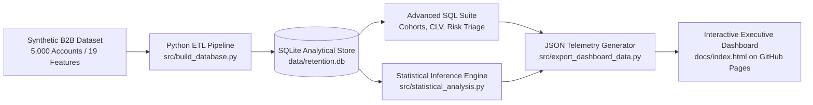

# SaaS Customer Churn & Revenue Retention Intelligence

[](https://petrepanntech.github.io/SaaS_Churn_Intelligence/)
[](https://python.org)
[](https://sqlite.org)
[](https://github.com/Petrepanntech/SaaS_Churn_Intelligence)
[](LICENSE)

An end-to-end B2B SaaS revenue intelligence and customer retention project. Built with Python, relational SQLite, advanced SQL analytics (CTEs, Window Functions), statistical inference, and an interactive executive web dashboard deployed on GitHub Pages.

**Live Interactive Dashboard:** [https://petrepanntech.github.io/SaaS_Churn_Intelligence/](https://petrepanntech.github.io/SaaS_Churn_Intelligence/)

---

## Executive Summary

Customer churn is the silent killer of subscription businesses. In this project, I audit and model a portfolio of **5,000 enterprise B2B accounts** representing **$1.93M in active Monthly Recurring Revenue (MRR)**.

By analyzing longitudinal cohort survival, contractual commitments, feature usage, support ticket velocity, and inactivity patterns, this system isolates **$37,000+ in immediate at-risk MRR** and diagnoses **$7.85M in cumulative annualized revenue leakage**.

```text
========================================================================
                       EXECUTIVE TELEMETRY AT A GLANCE
========================================================================
  * Audited Accounts        : 5,000 B2B Organizations
  * Active Portfolio MRR    : $1,933,837.40 / month
  * Cumulative Lost MRR     : $653,799.17 ($7.85M annualized)
  * Portfolio Churn Rate    : 24.7% (1,235 total exits)
  * High-Risk Accounts      : 96 enterprise accounts prioritized
  * Mean Customer Tenure    : 17.5 months
========================================================================
```

---

## Architecture & Data Pipeline



---

## Key Empirical Findings & Statistical Inference

Statistical odds ratios were calculated to quantify the exact likelihood of churn across customer segments:

### 1. Month-to-Month Contracts Exhibit a 4.27x Churn Odds Ratio
* Accounts on month-to-month contracts suffer a **31.8% churn rate** compared to **9.9%** for accounts on 2-year contracts.
* **Finding:** Contract duration is the single strongest structural buffer against revenue leakage. Month-to-month accounts have a **4.27x higher odds of churn** than 2-year agreements.

### 2. Support Ticket Velocity is an Early Warning Distress Signal (2.70x Odds Ratio)
* Accounts opening **4 or more support tickets** in a 30-day period experience a **44.2% churn rate** versus **22.6%** for accounts with under 4 tickets.
* **Finding:** In B2B SaaS, elevated ticket velocity reflects integration failure and user frustration rather than healthy product adoption.

### 3. The 14-Day Inactivity Threshold Triggers an Irreversible Cliff (2.53x Odds Ratio)
* Accounts where users have not logged in for **14 or more consecutive days** experience a **43.4% churn rate** (Odds Ratio: 2.53x).
* **Finding:** Automated customer success interventions must trigger at day 7. Waiting until renewal notice allows the account to slip into permanent dormancy.

---

## SQL Analytics Suite

All queries are documented in the [`sql/`](sql/) directory and can be inspected live on the web dashboard:

* **[`01_schema_setup.sql`](sql/01_schema_setup.sql):** Relational schema definition, columnar indexes, and the `v_executive_retention_kpi` analytical view.
* **[`02_cohort_retention.sql`](sql/02_cohort_retention.sql):** Multi-stage Common Table Expression (CTE) query tracking monthly customer retention rates at months 3, 6, and 12 across 30 signup cohorts.
* **[`03_revenue_leakage_clv.sql`](sql/03_revenue_leakage_clv.sql):** Financial aggregation isolating leaked MRR, Customer Lifetime Value (CLV), and subscription tier exposure.
* **[`04_risk_segmentation.sql`](sql/04_risk_segmentation.sql):** Multi-factor operational risk scoring using window functions (`DENSE_RANK() OVER (ORDER BY monthly_charges DESC)`) to assign prescriptive retention interventions.

---

## Prescriptive Retention Action Framework

Based on our diagnostic rules, at-risk accounts are automatically assigned targeted operational interventions:

| Risk Trigger | Diagnostic Indicator | Recommended Operational Intervention |
|:---|:---|:---|
| **Dormant Account** | Inactive >= 14 days and Adoption < 40% | Schedule Executive Re-engagement Audit & Workflow Refresh |
| **Product Friction** | Support Tickets >= 4 in 30 days | Deploy Senior Solution Engineer for Rapid Technical Triage |
| **Renewal Risk** | Month-to-Month Contract and NPS <= 5 | Present Annual Agreement with 15% Pricing Incentive |
| **Low Adoption** | Feature Adoption Score < 40% | Enroll in Hands-on Feature Utilization Clinic |

---

## Project Directory Structure

```text
SaaS_Churn_Intelligence/
├── .gitignore
├── LICENSE
├── README.md
├── data/
│   ├── customer_churn_records.csv    # 5,000 enterprise records (CSV)
│   └── retention.db                  # Relational SQLite database
├── sql/
│   ├── 01_schema_setup.sql           # Schema definition and indexes
│   ├── 02_cohort_retention.sql       # Longitudinal cohort retention matrix
│   ├── 03_revenue_leakage_clv.sql    # MRR leakage and CLV analysis
│   └── 04_risk_segmentation.sql      # Multi-factor risk triage query
├── src/
│   ├── generate_dataset.py           # Enterprise dataset synthesizer
│   ├── build_database.py             # CSV-to-SQLite ETL loader
│   ├── statistical_analysis.py       # Statistical inference and odds ratio engine
│   └── export_dashboard_data.py      # Telemetry JSON generator for GitHub Pages
└── docs/                             # GitHub Pages web application
    ├── index.html                    # Obsidian executive telemetry dashboard
    ├── css/
    │   └── dashboard.css             # Fluid responsive dark-mode styling
    ├── js/
    │   └── app.js                    # Interactive canvas charts and SQL runner
    └── data/
        └── telemetry.json            # Pre-computed analytical dataset
```

---

## Local Replication Guide

To reproduce this project locally:

### 1. Clone the repository:
```bash
git clone https://github.com/Petrepanntech/SaaS_Churn_Intelligence.git
cd SaaS_Churn_Intelligence
```

### 2. Generate the dataset and build SQLite database:
```bash
python src/generate_dataset.py
python src/build_database.py
```

### 3. Run statistical diagnostics:
```bash
python src/statistical_analysis.py
```

### 4. Export telemetry for dashboard:
```bash
python src/export_dashboard_data.py
```

### 5. Launch dashboard locally:
```bash
python -m http.server 8080 --directory docs
```
Open your browser to `http://localhost:8080` to interact with the dashboard.

---

## Deployment to GitHub Pages

To host the interactive dashboard for free on GitHub Pages:
1. Push this repository to your GitHub account: `https://github.com/Petrepanntech/SaaS_Churn_Intelligence`.
2. Navigate to **Settings** > **Pages**.
3. Under **Branch**, select `main` (or `master`) and set folder to `/docs`.
4. Click **Save**. Your dashboard will be live at `https://<username>.github.io/SaaS_Churn_Intelligence/`.

---

## Author & Contact

**Peter Akpan (Petre Pann)**  
*Data Analyst & Applied Data Scientist · Founder, Pann Labs*

* **Interactive Portfolio:** [https://petrepanntech.github.io](https://petrepanntech.github.io)
* **LinkedIn:** [https://linkedin.com/in/peter-akpan-69b76615b/](https://linkedin.com/in/peter-akpan-69b76615b/)
* **Email:** petrepann.tech@gmail.com
